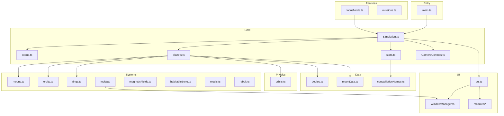
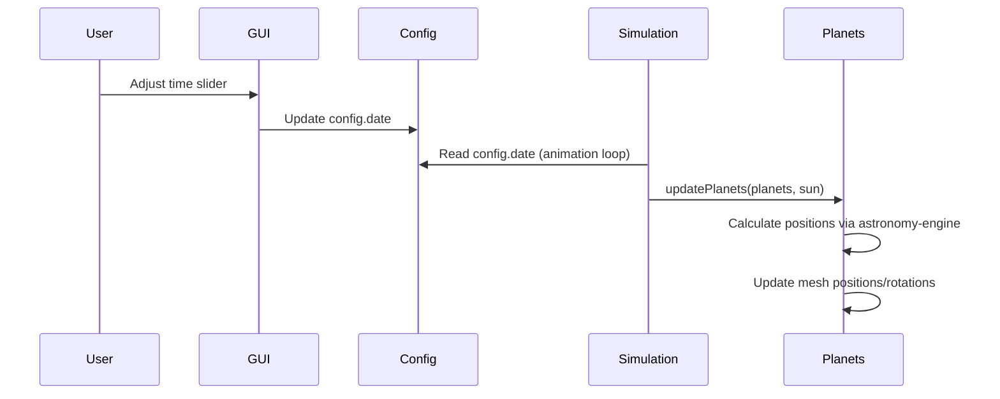

# White Rabbit Architecture

This document provides a detailed overview of the White Rabbit solar system simulator's architecture for contributors and AI assistants.

## High-Level Overview



## Directory Structure

```
src/
├── main.ts              # Entry point, initializes Simulation
├── config.ts            # Global configuration state (single source of truth)
├── types.ts             # Shared TypeScript interfaces and types
│
├── core/                # Core rendering and scene management
│   ├── Simulation.ts    # Main orchestrator class (animation loop, initialization)
│   ├── VirtualOrigin.ts # Large-scale coordinate handling (floating origin)
│   ├── scene.ts         # Three.js scene, camera, renderer, lighting setup
│   ├── planets.ts       # Planet/dwarf planet creation/updates
│   └── stars.ts         # Starfield, constellations, asterisms
│
├── controls/            # Camera controls
│   ├── CameraControls.ts # Camera movement and zoom handling
│   └── InputHandler.ts  # Keyboard/mouse input processing
│
├── data/                # Static data definitions (no logic)
│   ├── bodies.ts        # Planet properties (radius, period, texture, etc.)
│   ├── moonData.ts      # Moon definitions by category
│   ├── missions.ts      # Space mission trajectory data
│   ├── sun.ts           # Solar parameters
│   ├── zodiac.ts        # Zodiac constellation data
│   └── constellationNames.ts  # Constellation abbreviation mappings
│
├── physics/             # Pure math functions (no Three.js dependencies)
│   └── orbits.ts        # Keplerian orbit calculations
│
├── systems/             # Self-contained visual/physics subsystems
│   ├── moons.ts         # Moon creation and position updates
│   ├── orbits.ts        # Orbit line visualization
│   ├── rings.ts         # Planetary ring creation
│   ├── tooltips/        # Interactive tooltip/info window subsystem
│   ├── magneticFields.ts # Magnetic field visualizations
│   ├── habitableZone.ts # Habitable zone ring
│   ├── music.ts         # Background music system
│   ├── rabbit.ts        # Intro animation
│   ├── coordinates.ts   # Coordinate system transformations
│   ├── relativeOrbits.ts # Moon orbit lines relative to planets
│   └── zodiacSigns.ts   # Zodiac sign sprites
│
├── features/            # User-facing application features
│   ├── focusMode.ts     # Camera tracking and focus on objects
│   ├── events.ts        # Global event system
│   └── missions/        # Space mission visualization
│       ├── index.ts     # Barrel exports
│       ├── geometry.ts  # Trajectory geometry calculations
│       ├── interaction.ts # Mission click/hover handling
│       ├── probes.ts    # Probe 3D models
│       ├── state.ts     # Mission state management
│       ├── trajectory.ts # Trajectory line rendering
│       └── updates.ts   # Real-time mission updates
│
├── ui/                  # User interface
│   ├── gui.ts           # Main GUI orchestrator (lil-gui setup)
│   ├── WindowManager.ts # Draggable window management
│   ├── MenuDock.ts      # Bottom dock UI
│   ├── components/      # Reusable UI components
│   ├── styles/          # UI-specific CSS
│   └── modules/         # Individual UI modules
│       ├── TabbedWindow.ts  # Tabbed window component
│       ├── about.ts     # About dialog
│       ├── credit.ts    # Credits display
│       ├── events.ts    # Astronomical events panel
│       ├── find.ts      # Object search window
│       ├── miniOrreryTab.ts # Mini solar system view
│       ├── missionsTab.ts # Mission browser panel
│       ├── navigation.ts # Navigation controls
│       ├── sound.ts     # Music controls
│       ├── starsTab.ts  # Star visibility options
│       ├── stats.ts     # Performance statistics
│       ├── system.ts    # System settings
│       ├── systemTab.ts # Solar system object list
│       ├── time.ts      # Time/date controls
│       └── visual/      # Visual settings modules
│
├── materials/           # Custom Three.js materials
│   ├── MaterialFactory.ts # Material generation utilities
│   ├── MissionLineMaterial.ts # Mission trajectory shader
│   ├── OrbitLineMaterial.ts # Orbit line shader
│   ├── OrbitMaterial.ts # Orbit path rendering
│   └── SunMaterial.ts   # Sun shader material
│
├── managers/            # Resource managers
│   └── TextureManager.ts # Texture loading and caching
│
├── services/            # External service integrations
│   └── MusicService.ts  # Background music handling
│
├── utils/               # Utility functions
│   ├── Octree.ts        # Spatial data structure for star queries
│   ├── formatting.ts    # Number/text formatting utilities
│   ├── logger.ts        # Debug logging
│   ├── screenSpace.ts   # Screen coordinate utilities
│   ├── utils.ts         # General utilities
│   └── vectorUtils.ts   # 3D vector math helpers
│
└── api/                 # External API interfaces
    └── SimulationControl.ts # Simulation control API
```

## Key Design Principles

### 1. Separation of Concerns

| Directory | Purpose | Dependencies |
|-----------|---------|--------------|
| `physics/` | Pure math calculations | None (no Three.js) |
| `data/` | Static definitions | None |
| `core/` | Three.js scene graph | physics/, data/ |
| `systems/` | Visual subsystems | core/, config |
| `features/` | User features | systems/, core/ |
| `ui/` | Interface | config, features/ |

### 2. Single Source of Truth

- **`config.ts`**: All global state lives here
- **`config.date`**: Current simulation time
- **`config.simulationSpeed`**: Time multiplier

### 3. Modular UI

Each file in `ui/modules/` is a self-contained UI section that:
- Exports a `setup*Folder(gui: GUI, config: Config)` function
- Returns a lil-gui folder
- Is imported and orchestrated by `gui.ts`

## Data Flow



## Coordinate System

The simulation uses **Equatorial Coordinates (J2000 epoch)**:

- **X-Axis**: Vernal Equinox (0h Right Ascension)
- **Y-Axis**: North Celestial Pole (in Three.js, this is "up")
- **Z-Axis**: Perpendicular (completes right-handed system)

See [COORDINATE_SYSTEMS.md](./COORDINATE_SYSTEMS.md) for detailed transformation logic.

## Adding New Features

### New Planet/Moon
1. Add data to `src/data/bodies.ts` or `src/data/moonData.ts`
2. Add texture to `public/assets/textures/`
3. Run `npm run dev` to test

### New UI Control
1. Create `src/ui/modules/myfeature.ts`
2. Export `setupMyFeatureFolder(gui: GUI, config: Config): GUI`
3. Import in `src/ui/gui.ts`

### New Visual System
1. Create `src/systems/mysystem.ts`
2. Export create/update functions with proper types
3. Call from `Simulation.ts` init and animation loop

## Key Files Quick Reference

| File | Purpose |
|------|---------|
| `src/config.ts` | Global state, constants |
| `src/types.ts` | Shared TypeScript interfaces |
| `src/core/Simulation.ts` | Main class, animation loop |
| `src/core/planets.ts` | Planet creation/updates |
| `src/systems/tooltips/` | Object info display |
| `src/ui/gui.ts` | UI orchestration |
| `src/data/bodies.ts` | Planet data |
